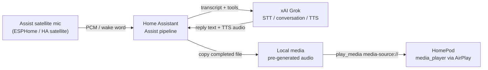

# HomePod Grok Bot architecture

HomePod Grok Bot is a Home Assistant voice path. Grok runs in the cloud via Home Assistant. HomePods are speakers only.

## Why the HomePod is output-only

The HomePod microphone is bound to Siri. This project does not jailbreak the device or replace that stack. Capture happens on a separate Assist satellite. Playback uses the Apple TV integration’s `media_player` entity.

## TTS reliability on HomePods

Sending a live TTS proxy URL (`/api/tts_proxy/...`) or calling `tts.speak` directly against a HomePod often fails or cuts off, especially on longer replies. Community reports point to AirPlay fetch/timeouts rather than Grok itself.

Practical sequence:

1. Generate TTS to completion (Grok TTS engine or HA TTS URL API).
2. Copy the finished MP3 into Home Assistant local media (`/media`).
3. Play it with `media_player.play_media` and a `media-source://media_source/local/...` URI.

That is the intended speaker path for HomePod Grok Bot. Direct proxy streaming to the HomePod is out of scope until core AirPlay behavior is reliable.

## What this repo will own later

Packaging is still TBD (HACS custom integration vs. a Home Assistant config package). Until then, this document is the contract: satellite in, Grok in the middle, HomePod out, local media for TTS.
